# PopularScienceBookRecommender

Here is the link to my presentation slides:
https://docs.google.com/presentation/d/1nPsGEysm2qXTsfTVbsp452d_3Vsx2KN3tID-S9_xX34/edit#slide=id.g3606f1c2d_30

## Books Worth Reading

I love reading, especially popular science books. I needed a popular science books recommender for years, and now I have it. Once, I deploy, feel free to use it.

    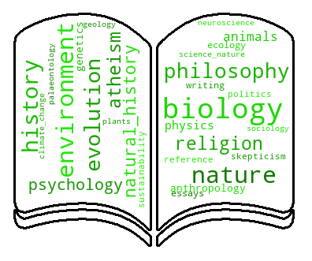

## The Dataset

I web-scraped GoodReads resourse for popular science books list, as well as ratings, reviews, and books metadata. I used Selenium and BeautifulSoup libraries for my scraping.

As a starting point I had: 300 books isbns, titles, and authors, each of them came with 300 ratings and 8 genres. I focused on genres as on my content information. 

## Clustering into Subgroups

Using genres information, I performed KMeans clustering of all books I have into 5 categories. Based on genres frequencies I named those subgroups as follows:

- Health and Medicine
- Psychology and Business
- Nature and Biology
- Space and Technology
- History and Philosophy

    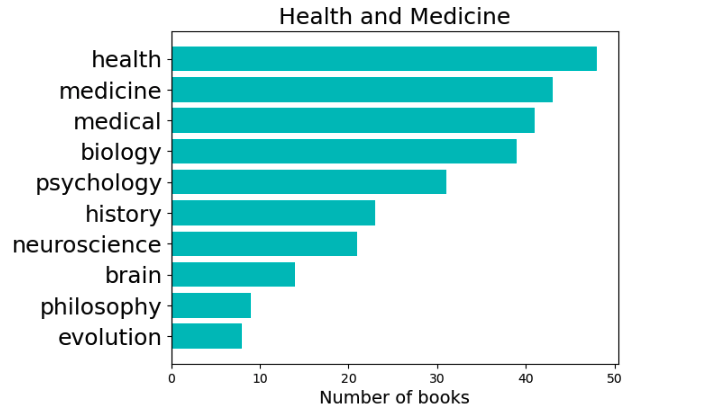
    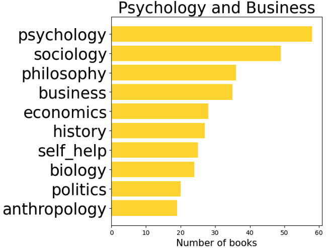
    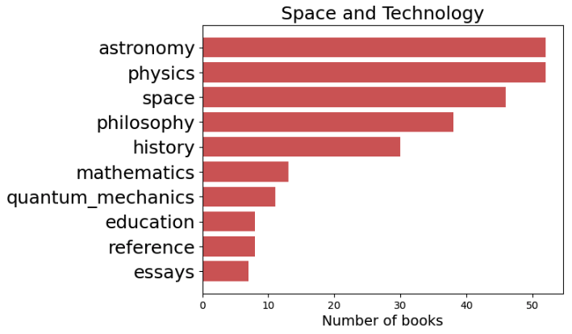
    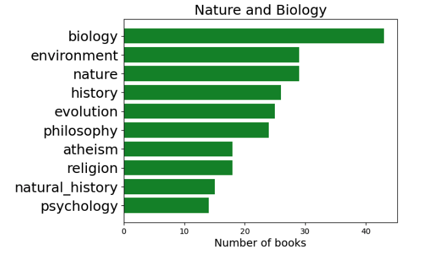
    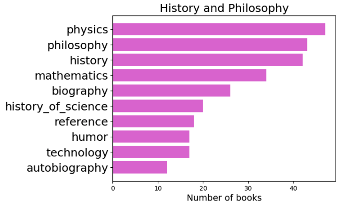

Those clusters can be used as filters later on, in order to provide a user a choice, if they want to explore a new field.

## Recommender system

I build two types recommenders: collaborative filtering and hybrid(content + collaborative).

### Collaborative filtering

For pure collaborative filtering, the data have been organized as follows:

    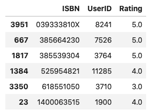

Using Surprise library, I have tested several build-in algorithms on small test dataset and check their performances first. For several selected models, I have rerun the test on the subset described above. 

    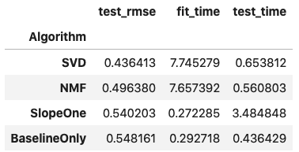

The algorithm predkct ratings for the active user, which can be then sorted, and filtered through subcategories if needed.

    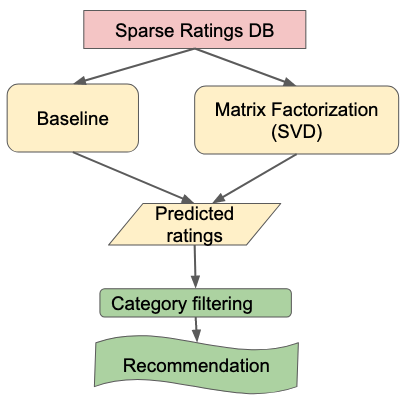

### Hybrid (content + collaborative)

Taking into account the content, which means user and books information, together with collaborative filtering leads to hybrid recommender system. 

As a content information I used books genres and user ratings. I used CountVectorizer from SkLearn to create bitwise vectors to represent genres. As for users, I started with ratings information. Performed a Singular Value Decomposition in order to reduce dimentionality to 7. Then, I have combined both matrices in order to fill out all missing reveiws from all the users in the rating matrix.

As a next step I performed pure collaborative filtering to predict active user recommendations. Sort those values, filter if needed and provide recommendations.

    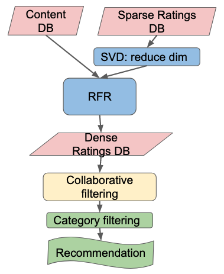

### Models comparison

Please check the RMSE scrores for models performances:

    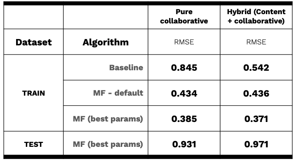

Although hybrid model works better with baseline algorithm, the two approaches perform closely with Matrix Factorization algorithm both on train and holdout sets.

## Insights

Further improvements of the model could be done by adding books description and user information into the content database. Using Natural Language Processing allows to quantify text information, whereas Singular Value Decomposition allows to reduce dimentionality of such matrices. 

## Future steps

- Add more books
- Productionize the recomendation model by building an interactive flask app and allowing users to upload their preferences from GoodReads.